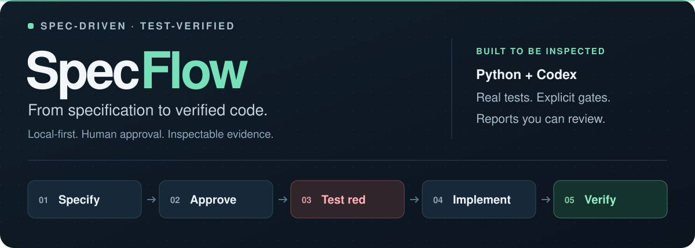
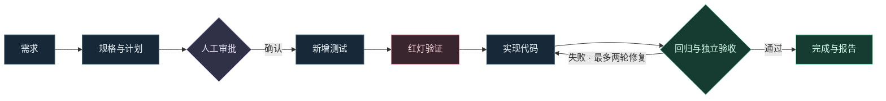

<p align="center">
  
</p>

<h1 align="center">SpecFlow · 规流</h1>

<p align="center">
  <strong>把需求变成可验证的代码，让 Agent 的每一步都有据可查。</strong><br>
  一个以 Python 和 Codex 为基础的本地规格驱动研发工作流。
</p>

<p align="center">
  <a href="https://github.com/x1975544-cloud/SpecFlow/actions/workflows/tests.yml"></a>
  <a href="https://github.com/x1975544-cloud/SpecFlow/releases/tag/v0.1.0"></a>
  <a href="pyproject.toml"></a>
  <a href="pyproject.toml"></a>
</p>

<p align="center">
  <a href="#快速体验">快速体验</a> ·
  <a href="#工作流程">工作流程</a> ·
  <a href="#真实验收">真实验收</a> ·
  <a href="https://github.com/x1975544-cloud/SpecFlow/releases/tag/v0.1.0">下载 v0.1.0</a> ·
  <a href="docs/ARCHITECTURE.md">架构文档</a>
</p>

---

## 为什么做 SpecFlow

让 Agent 修改代码之后，**需求是否被正确理解？测试是否真的执行？失败有没有被忽略？**

SpecFlow 把这些问题变成程序可以检查的步骤：先生成规格和计划，经确认后新增测试，看到真实的断言失败，再允许修改实现，最后运行回归测试与独立验收。代码差异、测试日志和阶段记录一起留存，便于复盘和展示。

首版面向 **Agent 工程学习、规格驱动开发实践与个人作品展示**。它围绕一个完整的待办 API 示例，展示从需求到验证的研发过程。

| 先明确要做什么 | 再验证有没有做对 | 最后保留过程证据 |
| :--- | :--- | :--- |
| 生成规格与任务计划，审批绑定当前内容 | 真实测试进程验证红灯、绿灯与独立验收 | 输出阶段历史、调用诊断、报告和代码差异 |
| 规划、测试、实现分角色调用 | 基线测试不可改，实现阶段不能改测试 | 支持阶段恢复，失败最多自动修复两轮 |

## 工作流程



**模型产出候选方案、测试和实现；程序根据文件变更与测试结果决定是否推进。** 修复次数耗尽后进入 `failed`，不会把“已经生成代码”当作完成。

## 真实验收

2026-09-25，SpecFlow 完成了一次真实 Codex 端到端运行。任务是为 `GET /tasks` 增加 `pending` / `done` 状态筛选，保留无参数请求行为，并对未知或空状态返回 `400`。

| 基线保持通过 | 先看到真实红灯 | 再通过绿灯回归 | 最后独立验收 |
| :---: | :---: | :---: | :---: |
| **3 项** | **14 项测试 / 12 次断言失败** | **17 项通过** | **5 项通过** |

红灯失败次数包含子测试，运行中没有导入错误或跳过项。本次保存红灯检查点后，通过新进程恢复，**实现尝试 1 次**即通过验收。

此外，项目自身 **18 项回归测试**与安装后的命令行演示已在 Windows / Linux CI 中通过。两组测试分别验证示例任务和 SpecFlow 本身。

→ [完整验收记录](docs/validation/2026-09-25/README.md) · [红灯日志](docs/validation/2026-09-25/red.log) · [绿灯日志](docs/validation/2026-09-25/green.log) · [实现差异](docs/validation/2026-09-25/diff.patch)

<details>
<summary><strong>这次真实运行也暴露并修复了一个问题</strong></summary>

首次规划中，Codex 曾网络重连，随后成功完成；执行器却把重连通知误判成终止失败。新增回归测试复现问题后，适配器改为只接受“已知重连通知之后出现成功完成事件，且结果合法”的情况，并保留重连诊断。修复后重新规划，完成了后续流程。

这是固定示例的一次真实成功记录，不代表任意仓库的成功率。规格由监督助手在用户继续执行的授权下审阅并执行审批；详细过程、四次角色调用和用量记录见验收文档。

</details>

## 快速体验

需要 **Python 3.12+**。离线演示不需要 Codex 登录，也不消耗模型额度。

### 1. 获取项目

```bash
git clone https://github.com/x1975544-cloud/SpecFlow.git
cd SpecFlow
```

### 2. 运行完整演示

在项目根目录直接运行，无需安装第三方 Python 运行依赖：

```bash
python -m specflow demo --scenario success --destination work/demo-success
```

完成后，终端状态应包含以下字段（节选）：

```json
{
  "mode": "offline_scripted",
  "stage": "completed",
  "implementation_attempts": 1,
  "acceptance": { "passed": true }
}
```

### 3. 查看结果

```bash
python -m specflow status work/demo-success
python -m specflow report work/demo-success
```

用浏览器打开生成的 **`work/demo-success/report.html`**，查看阶段记录、验证结果和代码差异。

> **离线演示的含义：** `demo` 使用标记为 scripted fixture 的固定角色替身，测试仍由真实 Python 子进程执行。它验证工作流，不代表模型完成了开发任务。每次演示请选择一个尚不存在的目标目录。

<details>
<summary><strong>体验失败与恢复场景</strong></summary>

```bash
python -m specflow demo --scenario failure --destination work/demo-failure
python -m specflow demo --scenario resume --destination work/demo-resume
```

| 场景 | 预期结果 | 观察重点 |
| :--- | :--- | :--- |
| `success` | `completed`，退出码 `0` | 完整红绿灯流程 |
| `failure` | `failed`，退出码 `2` | 验证失败阻止完成，重试有上限 |
| `resume` | `completed`，退出码 `0` | 保存红灯检查点后继续 |

失败演示是有意构造的验证场景，非零退出码符合预期。

</details>

<details>
<summary><strong>安装后，在任意目录使用 specflow 命令</strong></summary>

在项目根目录安装到当前 Python 环境：

```bash
python -m pip install .
specflow --help
```

也可从 [GitHub Releases](https://github.com/x1975544-cloud/SpecFlow/releases/tag/v0.1.0) 下载 wheel，然后在下载目录安装：

```bash
python -m pip install specflow_demo-0.1.0-py3-none-any.whl
specflow demo --scenario success --destination work/demo-success
```

发布页同时提供源码包。安装完成后，`specflow` 与 `python -m specflow` 提供相同的命令入口。

</details>

## 使用真实 Codex

本机需安装并登录 Codex CLI。SpecFlow 沿用已有模型配置，不读取或展示登录凭据，也不修改全局配置。真实调用会使用账户额度。

**检查环境并生成方案：**

```bash
python -m specflow doctor
# 如果尚未登录，先执行 codex login，再运行 doctor
python -m specflow init work/live-todo
python -m specflow run work/live-todo
```

此时任务停在 `awaiting_approval`。阅读 `work/live-todo/artifacts/spec.json` 和 `work/live-todo/artifacts/plan.md`，确认后再继续：

```bash
python -m specflow approve work/live-todo
python -m specflow resume work/live-todo
python -m specflow report work/live-todo
```

审批与当前需求、规格、计划及工作副本检查绑定；内容变化后不能沿用旧审批。默认单角色调用最长 **300 秒**，实现失败最多自动修复 **2 轮**；`run` 和 `resume` 支持 `--model`、`--timeout`。

<details>
<summary><strong>在红灯阶段暂停，再恢复</strong></summary>

在审批后执行：

```bash
python -m specflow resume work/live-todo --stop-after red
python -m specflow status work/live-todo
python -m specflow resume work/live-todo
```

也可按 `Ctrl+C` 中断。恢复以最后持久化阶段为准，未提交的阶段可能重新调用模型；它不是模型推理过程的续传，也不保证重复调用免费或产生相同结果。

</details>

## 每次运行会留下什么

```text
work/live-todo/
├── input/             原始需求
├── original/          原始项目副本
├── workspace/         已接纳的测试与实现
├── artifacts/         规格、计划、角色调用与验证日志
├── state.json         阶段、审批摘要、历史与用量
├── report.html        浏览器可读报告
├── report.md          Markdown 报告
└── diff.patch         相对原始项目的代码差异
```

报告明确区分 `live` 与 `offline_scripted`。`demo` 自动生成报告；普通任务需要执行 `report`，并在后续阶段完成后重新生成以反映最新状态。

## 设计与文档

| 想了解什么 | 从这里开始 |
| :--- | :--- |
| 如何演示成功、失败与恢复 | [演示指南](docs/DEMO.md) |
| 状态机、角色边界与设计取舍 | [架构文档](docs/ARCHITECTURE.md) |
| 首版范围及内部接口约定 | [构建契约](docs/BUILD_CONTRACT.md) |
| 真实模型到底完成了什么 | [验收记录](docs/validation/2026-09-25/README.md) |
| 每个版本交付了什么 | [更新记录](CHANGELOG.md) |

开发者可在项目根目录运行：

```bash
python -m unittest discover -s tests -v
```

项目测试使用执行器替身，不要求账户登录。GitHub Actions 还会构建安装包，并在源码目录之外验证安装后的命令行入口与三个演示场景。

## 适用范围

**适合：** 学习规格驱动的 Agent 工作流、实践可执行的 TDD 门禁、展示一次可复核的研发过程。

**当前范围：** 内置或兼容 `todo-status-v1` 的可信 Python 示例。尚不支持任意仓库开发；工作流本身不自动提交、推送或部署，也未接入企业系统。没有声称具备精确费用控制、量化的效率收益或任意外部操作回滚。

测试子进程使用本机用户权限。工作副本与文件变更检查用于防止常规误改，**不提供运行恶意仓库或恶意测试代码所需的操作系统级隔离**。

---

<p align="center">
  <strong>先把需求说清楚，再让测试证明它。</strong><br>
  <a href="https://github.com/x1975544-cloud/SpecFlow/releases/tag/v0.1.0">下载体验</a> ·
  <a href="https://github.com/x1975544-cloud/SpecFlow/issues">反馈问题与建议</a>
</p>
