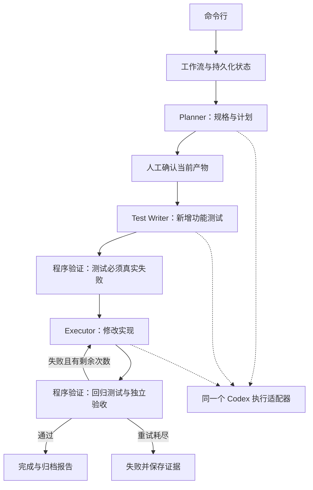

# 架构与设计取舍

SpecFlow 把阶段推进、人工确认和测试通过条件写进程序。模型负责产出候选方案、测试和实现，工作流负责决定这些产物能否进入下一阶段。首版通过固定的待办 API 验收场景，展示这条职责边界。

## 一次运行的组成

Planner、Test Writer 和 Executor 使用不同提示与文件修改范围，复用同一个执行器适配器。Verifier 在本版体现为确定性的程序验证步骤，不需要另一轮模型判断“是否完成”。

## 模块职责

| 模块 | 主要职责 |
| --- | --- |
| `cli.py` / `__main__.py` | 命令参数、状态展示、错误和退出码 |
| `engine.py` | 阶段推进、人工门禁、角色交接、失败重试和恢复 |
| `store.py` | 状态持久化、运行锁、文件摘要和记录 |
| `adapter.py` | 调用本机 Codex、校验结构化结果、保存执行诊断 |
| `testing.py` | 启动实际测试进程并判断测试结果 |
| `acceptance.py` | 独立的 `todo-status-v1` 验收，不作为角色可修改的项目文件 |
| `fixtures.py` | 离线演示使用的固定角色替身 |
| `sample/` | 尚未实现状态筛选的待办 API、已有测试和目标需求 |

运行时仅使用 Python 3.12 标准库。源码目录执行 `python -m specflow` 即可；真实角色调用额外依赖本机安装并登录的 Codex CLI。

## 阶段与门禁

1. **初始化。** 复制可信样例，保留已有行为、目标需求和来源信息。当前验收配置固定为 `todo-status-v1`。
2. **规划。** 生成规格、验收条件与实现任务。产物有效后停在 `awaiting_approval`。
3. **审批。** 对当前规格、计划和工作副本内容记录摘要。后续执行检查审批是否仍适用于当前产物。
4. **测试生成。** 在试运行副本中新增功能测试，不允许改写已有基线测试。
5. **红灯验证。** 实际执行测试。需要看到测试断言失败；语法错误、导入错误或没有执行测试不能作为有效的 TDD 红灯。
6. **实现与绿灯验证。** 实现角色修改允许的源文件，测试文件保持原样；运行回归测试和独立验收。失败信息用于后续修复，最多自动修复两轮。
7. **结束与归档。** 验证通过后记为 `completed`；不可继续或修复次数耗尽时记录 `failed` 及原因。报告保留执行方式和验证证据。

独立验收检查：无 `status` 参数时仍返回全部任务，`pending` / `done` 返回对应子集，未知值返回 `400`。它能揭示生成测试未覆盖的这些已知要求，但不能证明任意需求的正确性。

## 文件变更与执行范围

一次运行保留原始输入、累计工作副本和阶段试运行副本。角色只在当前阶段副本中工作；控制状态、审批记录和独立验收逻辑位于该目录之外。只有检查符合该角色修改范围的文件变更后，才将相应产物接纳回工作副本。

主要产物位置如下，均相对于一次运行的目标目录：

| 路径 | 内容 |
| --- | --- |
| `input/requirement.md` | 本次原始需求 |
| `original/` | 原始项目副本 |
| `workspace/` | 已接纳阶段变更的候选实现 |
| `state.json` | 当前阶段及 `history` 时间线 |
| `artifacts/spec.json` / `artifacts/plan.md` | 等待确认的规格和计划 |
| `artifacts/baseline/` | 初始测试结果 |
| `artifacts/role-call-*` | 各次角色调用诊断 |
| `artifacts/` 内的 red / green 测试目录 | 测试执行证据 |
| `report.md` / `report.html` / `diff.patch` | 调用 `report` 后生成的报告与变更差异 |

`demo` 在收尾时生成报告；普通阶段运行只更新状态与阶段产物，需要再次执行 `report` 来刷新可阅读报告。

这样可以拦截普通工作流中的越界修改，例如测试角色改动实现、实现角色删除测试或阶段输出修改了不允许的文件。文件差异检查并不能限制被执行代码的全部副作用。尤其是 Python 测试会以本机用户身份运行，不能把这里的“副本”理解为虚拟机、容器或恶意代码沙盒。

Codex 调用使用其工作区写入沙盒；该边界仍取决于已安装运行时的实际能力和配置。后续若支持不可信项目，需要额外的操作系统隔离、资源限制、网络策略和凭据隔离，不能只扩展一份命令黑名单。

## 中断、持久化与重试

状态使用原子写入，运行锁避免两个流程同时推进同一运行目录。每阶段保留输入、执行结果与诊断；阶段完成后更新检查点。`resume` 根据已保存状态选择下一步，而不是从需求输入重新开始。

若在角色调用或阶段提交之前退出，该阶段可以重新执行。外部模型调用不具备本项目保证的“恰好一次”语义；重复执行可能增加调用量。恢复流程需要区分已确认产物与未接纳的试运行结果，不能把试运行目录中的存在文件直接当作阶段成功。

修复次数受程序限制。一次调用也有超时上限，默认 300 秒。模型调用失败、结构化结果不合法、测试失败和审批失效应保留可识别的原因，不能被统一记成成功或无限重试。

## 适配器契约

`CodexAdapter.check()` 检查可执行程序、版本和认证状态，不调用模型、不读取或返回认证文件。`run()` 接收角色、提示、阶段目录与诊断目录，通过独立进程调用 `codex exec`，读取 JSON 事件并使用输出 schema 约束最终结果。

结果包含 `summary`、`acceptance_criteria`、`tasks`。进程成功退出本身并不足够：还需要有效的完成事件和符合 schema 的最终输出。明确失败事件、超时、缺失完成事件或无效结果都应转为适配器错误。

Windows 优先使用可以直接调用的二进制，或定位 CLI 的 Node.js 入口；不把提示内容拼接成 shell 命令。平台沿用本机账户与模型配置，不写全局配置。

## 演示证据与扩展方向

`offline_scripted` 离线演示检验的是流程控制和真实测试执行。`live` 验收还需要实际 Codex 角色调用、任务所需的新增测试与源代码修改、红绿测试证据及最终差异。两类记录必须分开说明；单元测试通过或登录成功不能冒充真实模型完成。

优先扩展点是新的验收配置、更多受控示例和可替换执行器。通用仓库分析、网页控制台、企业工具链、外部操作补偿和精确成本控制不属于本版交付。扩展前应先用真实任务度量通过率、返工次数、耗时与调用量，再决定增加哪些角色和阶段。
